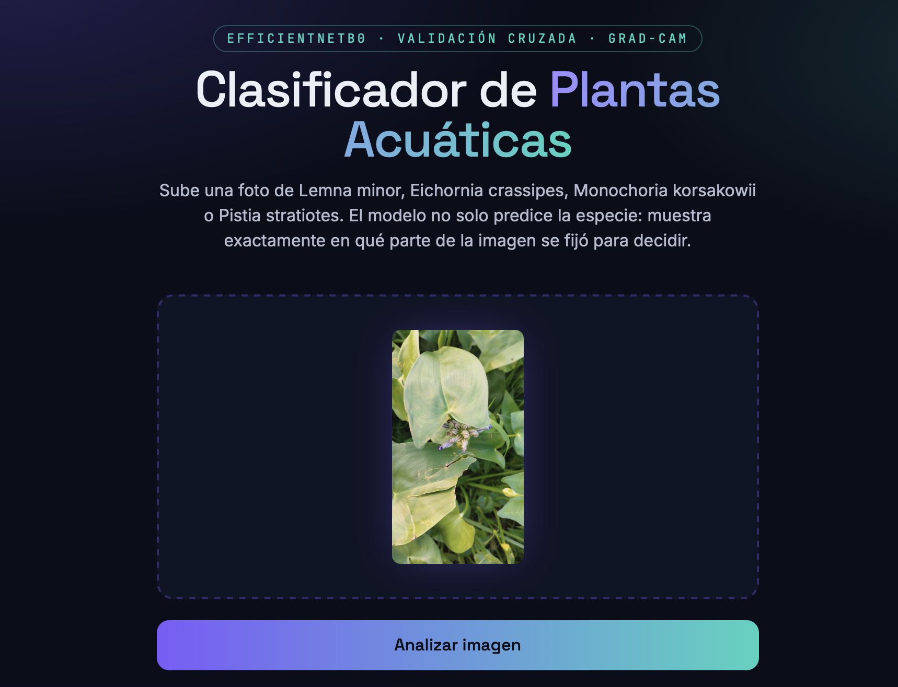
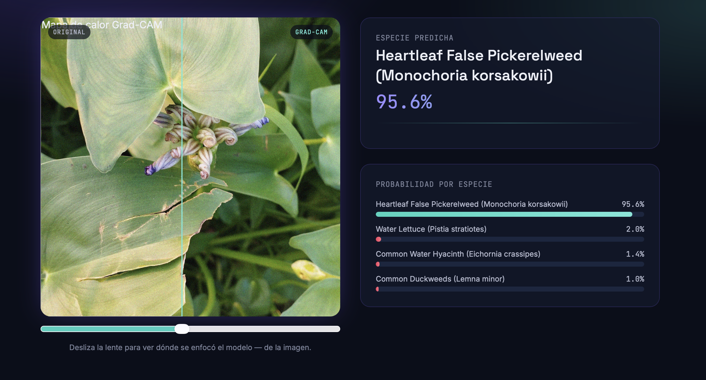
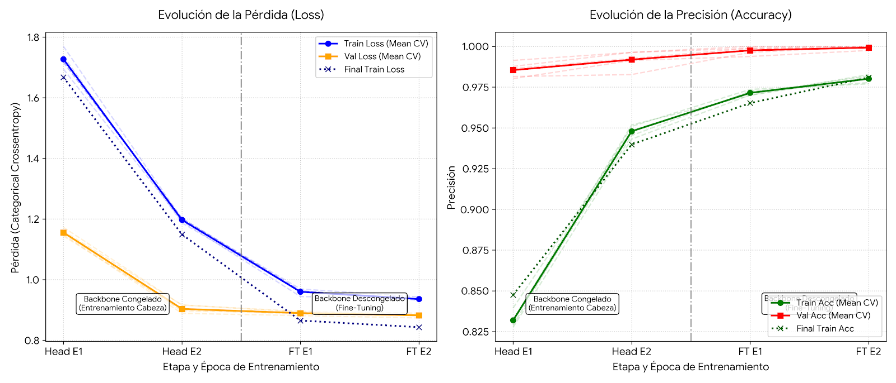

# 🌿 Aquatic Plants Classifier

Clasificador de especies de plantas acuáticas con **transfer learning
(EfficientNetB0)**, **validación cruzada estratificada (5 folds)** para
una estimación de precisión confiable, y **explicabilidad vía Grad-CAM**
— cada predicción viene acompañada del mapa de calor que muestra
exactamente en qué parte de la imagen se fijó el modelo para decidir.

Incluye una API REST (Flask) y un frontend moderno (React + Vite) para
probar el modelo subiendo una foto desde el navegador.


---

## 📸 Vista previa

| Pantalla principal | Predicción + explicabilidad Grad-CAM |
|---|---|
|  |  |

El slider central en la segunda captura es la **"lente de
explicabilidad"**: se desliza sobre la foto original para revelar el
mapa de calor Grad-CAM superpuesto, mostrando en qué hojas o
estructuras de la planta se fijó el modelo.

## 🧠 Especies que reconoce

| Especie | Nombre científico |
|---|---|
| Common Duckweed | *Lemna minor* |
| Common Water Hyacinth | *Eichornia crassipes* |
| Heartleaf False Pickerelweed | *Monochoria korsakowii* |
| Water Lettuce | *Pistia stratiotes* |

## ✨ Características

- **EfficientNetB0** como backbone por defecto, intercambiable por
  `EfficientNetB1`, `ResNet50V2` o `MobileNetV3Large` sin tocar el resto
  del pipeline (ver [`src/training/config.py`](src/training/config.py)).
- **Validación cruzada estratificada (K-Fold)**: el modelo se entrena y
  evalúa 5 veces sobre particiones balanceadas por clase, y se reporta
  media ± desviación estándar, no un único número optimista.
- **Pesos de clase automáticos** para que el modelo no favorezca a la
  especie con más fotos en el dataset.
- **Explicabilidad real**: cada predicción de la API trae su heatmap
  Grad-CAM y una explicación en texto plano de en qué región se fijó el
  modelo y con qué nivel de confianza.
- **Frontend con "lente de explicabilidad"**: el slider comparador que
  se ve arriba.

## 📊 Resultados del entrenamiento

Entrenamiento de 4 épocas por fase (2 con el backbone congelado, 2 de
fine-tuning) sobre 5 folds estratificados, seguido de un reentrenamiento
final con el 100% del dataset.



| Métrica (validación cruzada, 5 folds) | Media ± desv. estándar |
|---|---|
| Accuracy | 0.9993 ± 0.0010 |
| AUC | 1.0000 ± 0.0000 |

| Modelo final (100% del dataset) | Valor |
|---|---|
| Train Loss | 0.8432 |
| Train Accuracy | 98.09% |

**Lectura de las curvas:**

- **Transfer learning efectivo**: ya en la primera época de cabeza
  (`Head E1`) la accuracy de validación supera el 98% en los 5 folds,
  confirmando que las features de `EfficientNetB0` preentrenado en
  ImageNet transfieren bien a estas 4 especies.
- **Fine-tuning estable**: al descongelar el backbone (`FT E1`–`FT E2`)
  el loss baja de forma monótona (de ~1.7 a ~0.84) sin picos ni
  divergencia, gracias al learning rate bajo (`1e-5`) usado en esa fase.
- **Folds consistentes**: las líneas finas de fondo (cada fold
  individual) están muy juntas entre sí, lo que indica que el resultado
  no depende de qué imágenes cayeron en cada partición.

### ⚠️ Nota técnica honesta sobre estos números

Una accuracy de validación de ~99.9% y AUC de 1.0 en los 5 folds, con
solo 4 épocas por fase, es un resultado **inusualmente alto** para un
problema de 4 clases — incluso con transfer learning. Antes de
presentar este modelo como definitivo conviene descartar la causa más
común de un número así de optimista:

> **Fuga de datos entre train y validación.** Si el dataset que se usó
> para entrenar es la carpeta *ya aumentada* (`Augmented Images`) y el
> split de K-Fold se hizo a nivel de archivo individual en vez de a
> nivel de foto original, es muy probable que varias copias aumentadas
> de la **misma foto fuente** hayan quedado repartidas entre el set de
> entrenamiento y el de validación de un mismo fold. El modelo no
> estaría generalizando a plantas nuevas; estaría reconociendo
> variaciones de fotos que ya "vio" en otra forma durante el
> entrenamiento.

Esto no invalida el pipeline ni el trabajo hecho — el código de K-Fold,
class weights y Grad-CAM es correcto — pero sí significa que el número
exacto (99.9%) probablemente no sobreviva a fotos genuinamente nuevas.
Antes de publicar este resultado como definitivo en el repositorio,
recomiendo:

1. Agrupar las imágenes por foto original (no por archivo aumentado)
   antes de hacer el split, usando `StratifiedGroupKFold` de
   scikit-learn en vez de `StratifiedKFold`.
2. Evaluar contra un **holdout externo**: fotos que no pasaron por el
   proceso de aumentación en absoluto (ver
   [`docs/DATASET.md`](docs/DATASET.md)).

Si después de ese ajuste la accuracy se mantiene muy alta, genial — pero
así sabrás que el número es real y no un artefacto del split.

## 🗂️ Estructura del repositorio

```
.
├── src/
│   ├── training/        # config, dataset, arquitectura, entrenamiento K-Fold
│   ├── inference/        # predictor de alto nivel + Grad-CAM
│   ├── api/               # API Flask (/api/predict, /api/classes, /api/health)
│   └── utils/             # semillas, métricas, gráficas
├── frontend/              # React + Vite — interfaz de carga y resultados
├── docs/
│   ├── screenshots/       # capturas usadas en este README
│   ├── ARCHITECTURE.md
│   ├── DATASET.md
│   ├── TRAINING.md
│   └── API.md
├── requirements.txt
└── README.md
```

Ver [`docs/ARCHITECTURE.md`](docs/ARCHITECTURE.md) para el detalle de cada módulo.

## 🚀 Inicio rápido

### 1. Backend — entrenar el modelo

```bash
python -m venv .venv && source .venv/bin/activate   # Windows: .venv\Scripts\activate
pip install -r requirements.txt
```

Descarga el [Aquatic Plants Image Dataset](https://data.mendeley.com/datasets/vz6z64nwby/1)
(Mendeley Data) y coloca la carpeta de imágenes aumentadas en `./data/Augmented Images`,
o exporta la ruta:

```bash
export AQUATIC_DATASET_DIR="/ruta/a/Augmented Images"
```

Entrena con validación cruzada de 5 folds:

```bash
python -m src.training.train --backbone efficientnetb0 --folds 5
```

Esto deja en `artifacts/`:
- `folds/fold_N/best.keras` — mejor checkpoint de cada fold
- `reports/cross_validation_summary.json` — métricas promedio ± desviación
- `final_model/model.keras` — modelo final reentrenado con todo el dataset

Ver guía completa en [`docs/TRAINING.md`](docs/TRAINING.md).

> Los pesos entrenados (`*.keras`) no se incluyen en este repositorio
> por tamaño — quedan excluidos vía `.gitignore`. Sube el dataset y
> reentrena localmente, o publica los pesos por separado (Releases de
> GitHub, Hugging Face, etc.) si quieres distribuir el modelo ya
> entrenado.

### 2. Backend — levantar la API

```bash
export AQUATIC_MODEL_DIR=./artifacts/final_model
python -m src.api.app
```

La API queda en `http://localhost:5000`. Detalle de endpoints en [`docs/API.md`](docs/API.md).

### 3. Frontend

```bash
cd frontend
npm install
npm run dev
```

Abre `http://localhost:5173`. En desarrollo, Vite redirige `/api/*` hacia
el backend en el puerto 5000 (ver `frontend/vite.config.js`).

## 📊 Por qué validación cruzada y no un solo split

Con un dataset de tamaño moderado y solo 4 clases, un único split
train/val fijo puede dar una precisión que es más fruto del azar (qué
imágenes cayeron de cada lado) que del modelo en sí. K-Fold estratificado
entrena K modelos sobre particiones distintas —todas con la misma
proporción de cada especie— y promedia el resultado.

## 🔍 Por qué explicabilidad (Grad-CAM)

Un clasificador de especies que solo da un porcentaje es una caja negra:
no hay forma de saber si aprendió a reconocer la planta o, por ejemplo,
el color del agua de fondo en las fotos de entrenamiento. Grad-CAM
calcula el gradiente de la clase predicha respecto a la última capa
convolucional del backbone, lo que da un mapa de qué regiones de la
imagen más influyeron en la decisión. Esto se expone tanto en la API
(`gradcam_overlay_base64`) como en el frontend (slider comparador, ver
captura arriba).

## 🛣️ Roadmap

- [ ] Agrupar por foto original al hacer K-Fold (`StratifiedGroupKFold`)
      para eliminar la fuga de datos entre augmentaciones de la misma foto.
- [ ] Holdout externo (fotos propias, no del dataset de Mendeley) para
      una evaluación final menos optimista que la validación cruzada.
- [ ] Ensamble de los K modelos de los folds en vez de un solo modelo final.
- [ ] Métricas de calibración (reliability diagram) además de accuracy.
- [ ] Dockerfile para desplegar API + frontend juntos.

## 📄 Licencia

MIT — ver [`LICENSE`](LICENSE).

## 🙏 Dataset

[Aquatic Plants Image Dataset](https://data.mendeley.com/datasets/vz6z64nwby/1), Mendeley Data.
